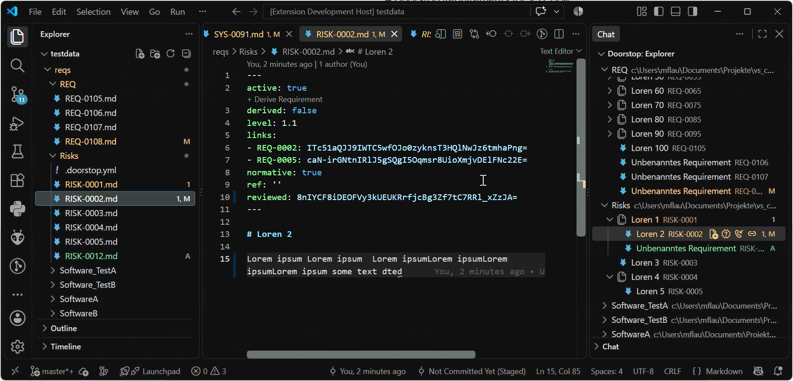
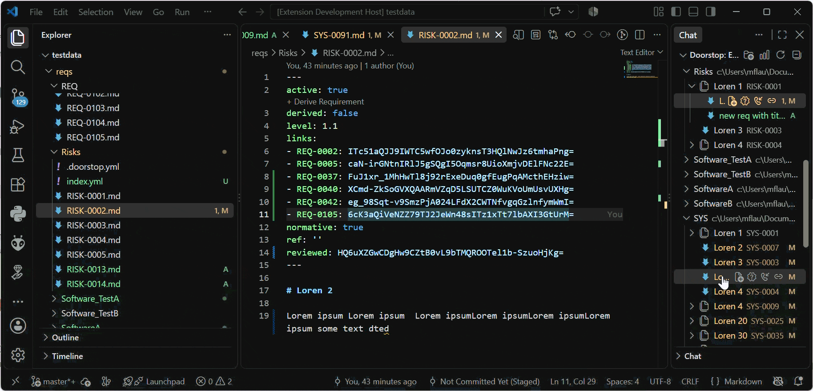
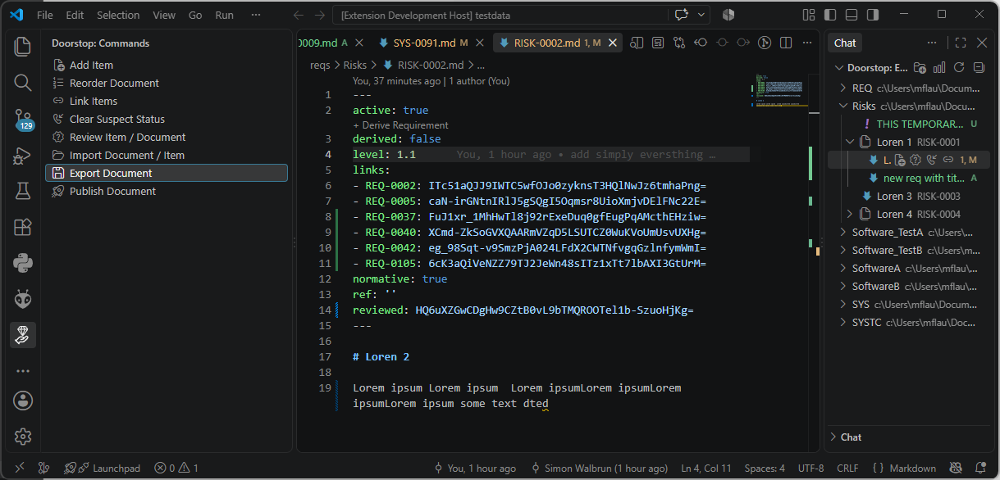
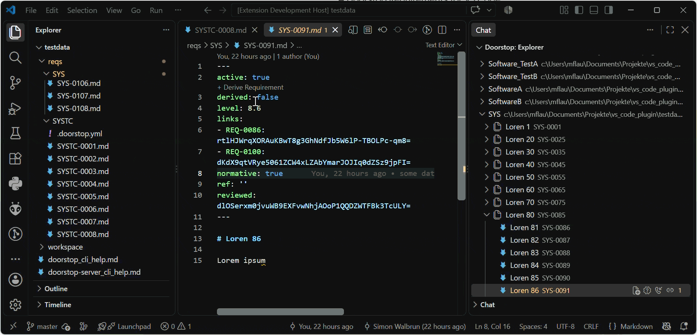
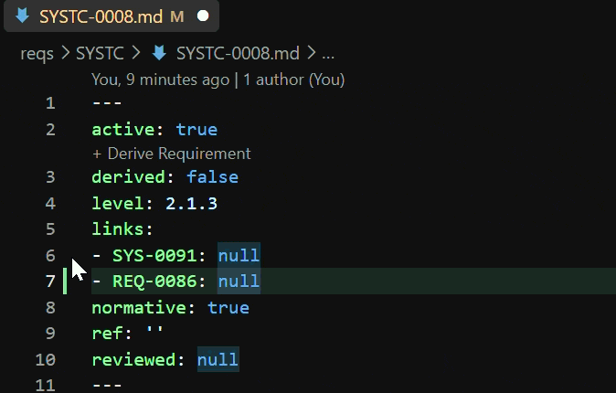
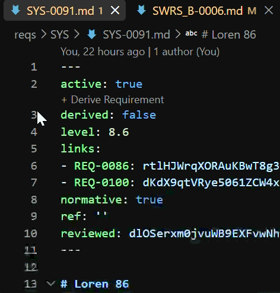
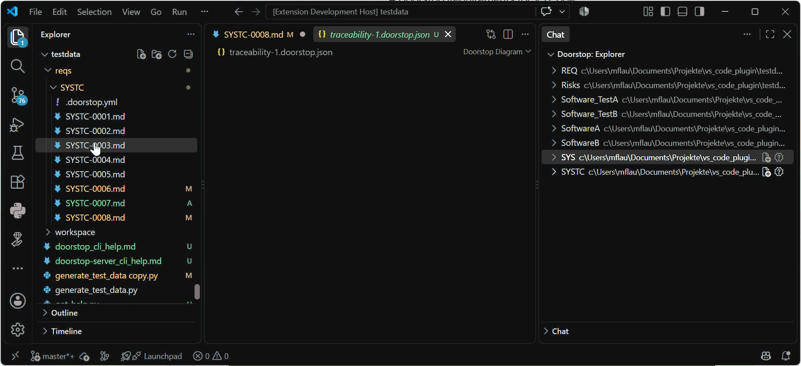

# Doorstop Requirements for VS Code

Seamlessly manage, view, and navigate [Doorstop](https://doorstop.readthedocs.io/) requirement items directly inside VS Code.

This extension brings requirement lifecycle management into your developer workflow—from interactive tree views and inline editor actions to smart autocompletion and hover previews.

---

## Features

### Doorstop Explorer & Commands

**Requirement Tree View:** Browse all your Doorstop documents and items directly in the SideBar ordered by level of the items.


**Inline Node Actions:** Quickly **Add**,

**Review**, **Clear Suspect Status**, or

**Link** items via inline action buttons on hover.


**Global Utilities:** Access frequent operations (Reorder, Import, Export, Publish) from the dedicated panel or the VS Code Command Palette.



### Editor Integration (CodeLens & IntelliSense)

 **CodeLens Derivation:** Derive downstream requirements with a single click directly above your requirement definitions.
 

 **Smart Autocompletion (IntelliSense):** Autocomplete upstream links with history support showing recently opened items at first.


### Hover Previews & Navigation

Hover in editor over `links` e.g. (`REQ-0001`, `SYS-0002`):

* **Requirement Title & Level:** Header and hierarchy level.
* **Requirement Text:** Fully rendered specification description.
* **Traceability Links:** clickable parent requirement IDs.

Hover in editor over `derived`:

**Traceability Links:** clickable list of linked child requirement IDs.


### 🎨 Requirements Canvas

Collect and organize requirements on a visual canvas for spatial planning (and some future release traceability mapping).


---

## Requirements

For full requirement lifecycle management (creating documents, linking items, running validations), ensure [Doorstop](https://pypi.org/project/doorstop/) is installed in your environment:

```bash
pip install doorstop
```
