# Doorstop Requirements for VS Code

Manage, view and navigate [Doorstop](https://doorstop.readthedocs.io/) requirements without leaving VS Code.
Every Doorstop command is available where you need it: in the explorer, in the editor and on a visual canvas.

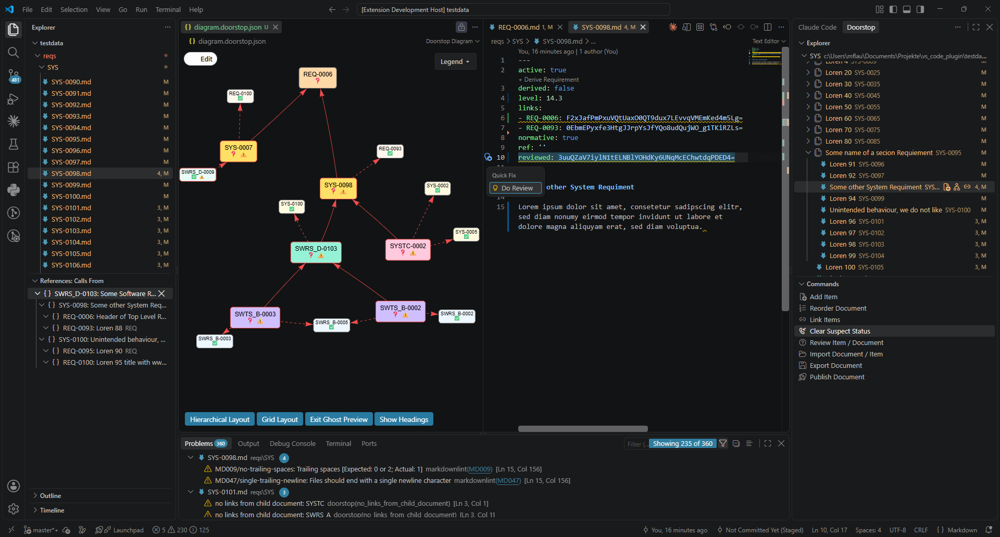

## Features

### Canvas

Place requirements on a canvas and work with them visually.

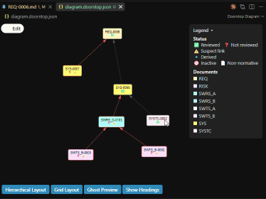

- Items: add, create linked, remove from canvas
- Links: create, remove
- Ghost preview: every item linked to the canvas is shown as a smaller node
- Auto layout: hierarchical or grid

Create a new canvas from the explorer title bar:

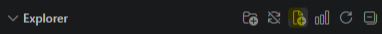

### Explorer

All documents and items in the side bar.

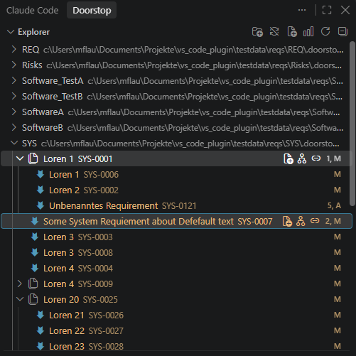

- One flat list per document, items ordered by level
- Context menu: Add, Derive, Review, Clear Suspect, Link, Add to Diagram
- Inline on hover: Add, Call Hierarchy, Link
- Global commands in the **Commands** view: Reorder, Import, Export, Publish

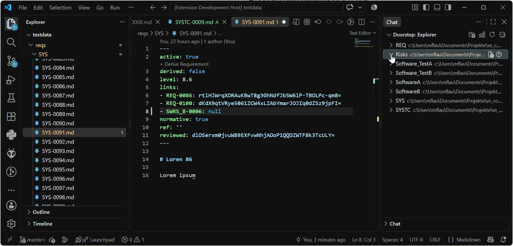

### Problems & Quick Fixes

Every issue Doorstop reports appears in the Problems panel and inline in the file it concerns, anchored to the field it is about (`links`, `reviewed`, `derived`, `level`, `ref`, or the document config).

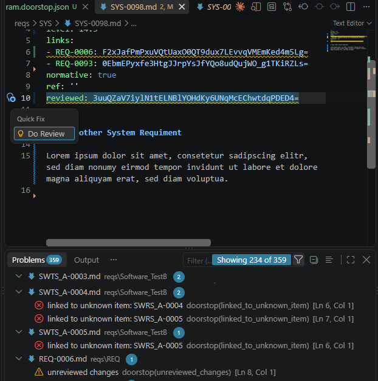

Quick fixes (`Ctrl+.`) resolve them in place:

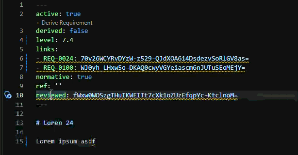

- **Do Review** marks the item as reviewed
- **Clear Suspect Link** clears one link, **Clear All Suspect Links** clears all of them

Problems refresh on save, after every change the extension makes, and on demand via **Doorstop: Re-check Problems**. The messages are Doorstop's own, so they match the `doorstop` command line.

### Go to Definition & References

Press `F12` on a link or a `derived` entry to jump to the item; `Shift+F12` lists all references.

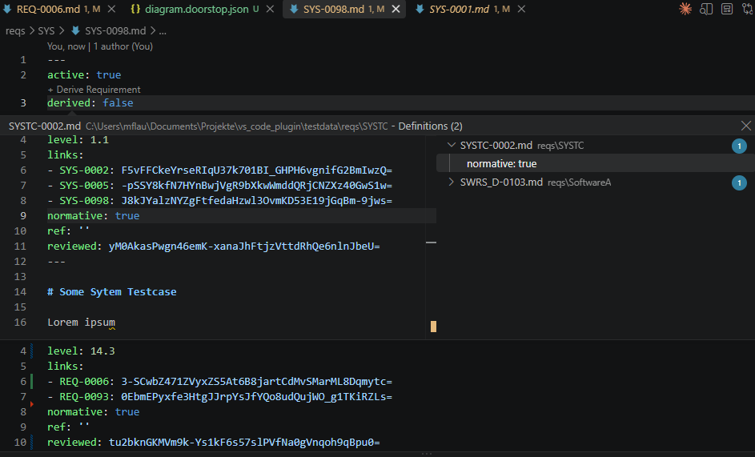

### Traceability (Call Hierarchy)

Trace an item up- and downstream as a call hierarchy: **outgoing** shows the items it links to, **incoming** the items that link to it. Every entry expands further.

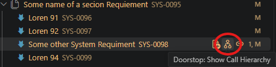

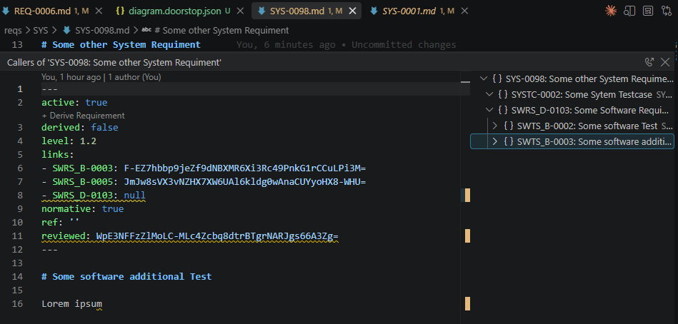

### Editor Integration

- **CodeLens:** derive a downstream requirement with one click above the item
- **IntelliSense:** autocomplete link targets, recently opened items first
- **Hover:** preview title, level and text of any linked or derived item

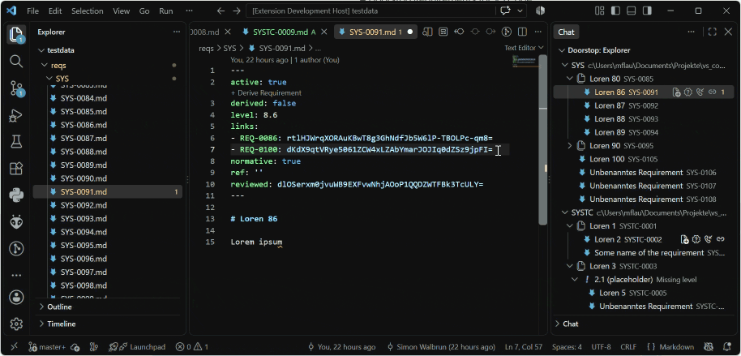

## Requirements

The extension talks to a small local server that wraps the Doorstop Python API. Install it into the Python environment of your workspace (the extension will offer to do this for you):

```bash
pip install doorstop-vscode-server
```
