# Doorstop Requirements for VS Code

Manage, view and navigate [Doorstop](https://doorstop.readthedocs.io/) requirements without leaving VS Code.
Every Doorstop command is available where you need it: in the explorer, in the editor and on a visual canvas.

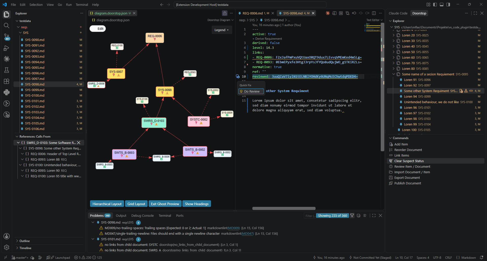

## Features

### Canvas

Place requirements on a canvas and work with them visually.

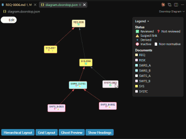

- Items: add, create linked, remove from canvas
- Links: create, remove
- Ghost preview: every item linked to the canvas is shown as a smaller node
- Auto layout: hierarchical or grid

Create a new canvas from the explorer title bar:

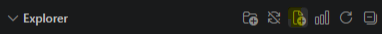

### Explorer

All documents and items in the side bar.

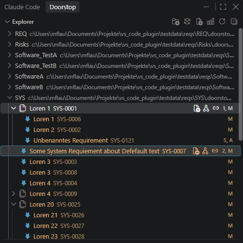

- One flat list per document, items ordered by level
- Context menu: Add, Derive, Review, Clear Suspect, Link, Add to Diagram
- Inline on hover: Add, Open as document, Call Hierarchy, Link
- Global commands in the **Commands** view: Reorder, Import, Export, Publish
  (one document or `all`), Generate Status Report; a progress notification
  shows while a command works
- **Generate Status Report** writes `doorstop-status.md` with Mermaid charts:
  items per document, problems per type for each document, and changed item
  files per week over the last 26 weeks (from git)

### Document View

Read and edit a whole document as one markdown file instead of jumping
between item files - for developers and for project managers who never want
to see YAML.

- **Open as document** on a document node (or *Doorstop: Open Document View*)
  opens a tab `<PREFIX> (document)`: every active item in level order as a
  heading plus its text, separated by dimmed `<!-- SYS-0006 · 1.1 · item
  separator. keep this line -->` comments; every second block is tinted
  (theme colour `doorstop.documentView.altBlockBackground`)
- Edit headings and text like any markdown; `Ctrl+S` writes only the items
  that changed - through Doorstop, nothing else in the item files is touched
- Separator lines are managed: typing into one is reverted; a deleted or
  merged block asks **Delete / Keep / Cancel** before anything is removed;
  broken structure is flagged while typing with a **Restore block structure**
  quick fix and refuses the save
- **+ New item below** (action line) or *Doorstop: Insert Item Here* inserts a
  placeholder that becomes a new item after the block above it on save; a
  typed heading never creates an item by accident
- Every block's action line offers Open item, Review, Derive, Link..., the
  link count and Clear suspect link; Doorstop's problems appear on the
  separators with the same quick fixes as in item files; hover, `F12`,
  references and call hierarchy work on the UIDs
- Changes on disk (other tabs, commands, git) refresh the view; with unsaved
  edits you are asked to **Reload** or **Keep my edits**

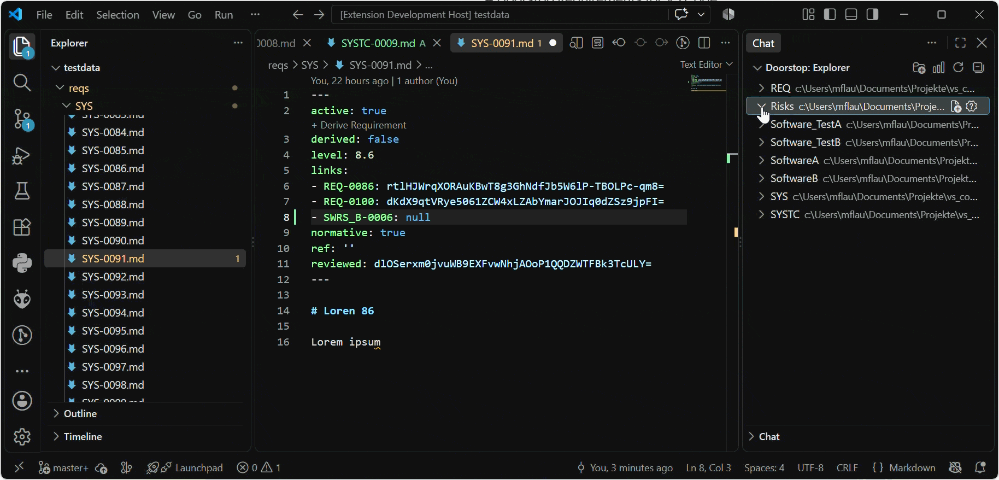

### Problems & Quick Fixes

Every issue Doorstop reports appears in the Problems panel and inline in the file it concerns, anchored to the field it is about (`links`, `reviewed`, `derived`, `level`, `ref`, or the document config).

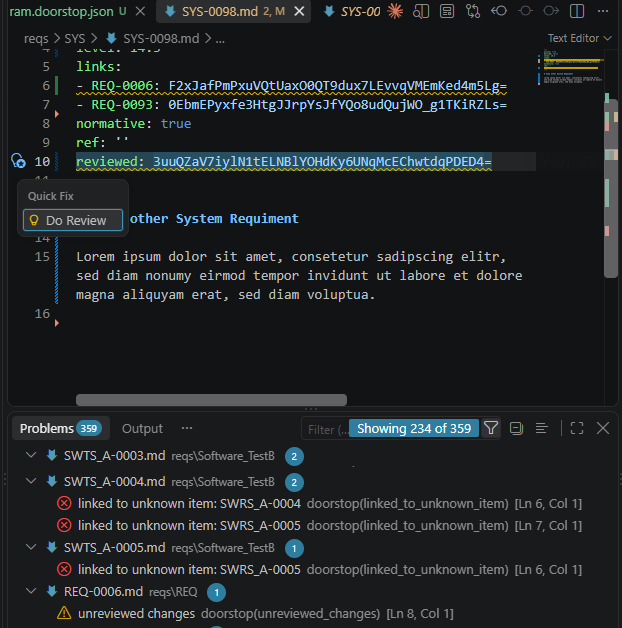

Quick fixes (`Ctrl+.`) resolve them in place:

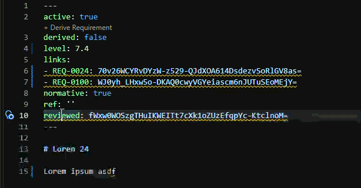

- **Do Review** marks the item as reviewed
- **Clear Suspect Link** clears one link, **Clear All Suspect Links** clears all of them

Problems refresh on save, after every change the extension makes, and on demand via **Doorstop: Re-check Problems**. The messages are Doorstop's own, so they match the `doorstop` command line.

### Go to Definition & References

Press `F12` on a link or a `derived` entry to jump to the item; `Shift+F12` lists all references.

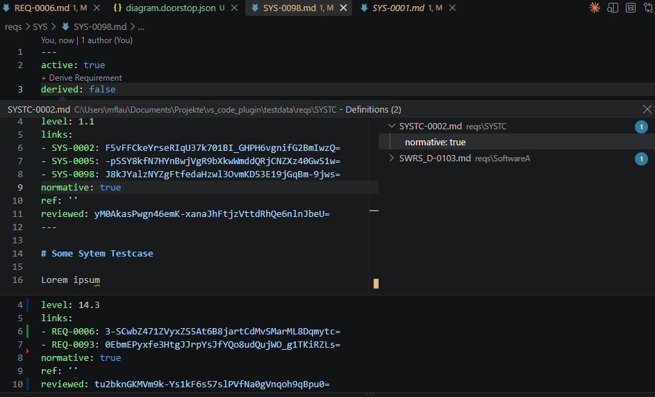

### Traceability (Call Hierarchy)

Trace an item up- and downstream as a call hierarchy: **outgoing** shows the items it links to, **incoming** the items that link to it. Every entry expands further.

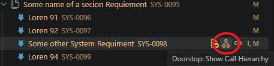

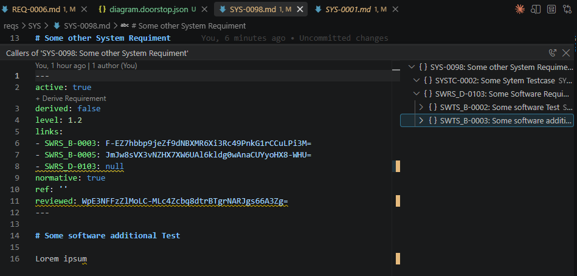

### Filter Notebooks

*Doorstop: New Filter Notebook* (also in the Commands panel) opens a notebook where every code cell is one filter. Run a cell to get a table of the matching items with a count above it; click a UID to open the item. A new notebook starts with a short cheat-sheet, a simple and a complex example. Save it as `*.doorstop-filter` to reuse it.

Filters are YAML in the shape of Obsidian Bases filters: `and:` / `or:` / `not:` groups nest freely, `hasChild:` / `hasParent:` match on direct children or parents, and conditions work on the built-in attributes (`uid`, `document`, `level`, `header`, `text`, `ref`, `active`, `normative`, `derived`, `reviewed`, `links`) and on any custom attribute.

```yaml
# REQ items that have an approved child
and:
  - document == "REQ"
  - hasChild: status == "approved"
```

```yaml
# unreviewed items without a ref, from level 2 on
and:
  - reviewed == false
  - ref.isEmpty()
  - level >= "2"
```

```yaml
# pick the table columns, Bases-style (UID always comes first)
filters: document == "TST"
order: [status, owner, header]
```

Conditions are `attribute <op> value` (`==` `!=` `<` `<=` `>` `>=`) or `.contains("…")`, `.startsWith("…")`, `.isEmpty()`, `.isNotEmpty()`. Use groups instead of `!`, `&&` or `||`, and write levels as strings. Without `order:` the table shows document, level and header.

### Editor Integration

- **CodeLens:** derive a downstream requirement with one click above the item
- **IntelliSense:** autocomplete link targets, recently opened items first
- **Hover:** preview title, level and text of any linked or derived item

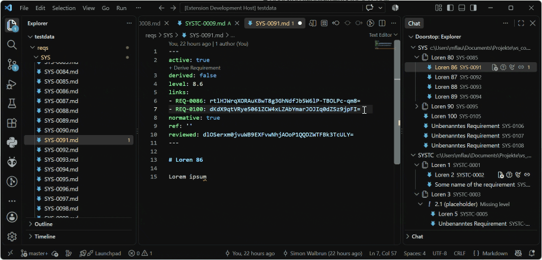

## Settings

Search for "Doorstop" in the VS Code settings:

- **Problems:** one checkbox per kind of Doorstop problem; unticked kinds are hidden from the Problems panel and the document view (all on by default)
- **New Document:** item format (YAML / Markdown), UID separator (none, `-`, `.`, `_`) and number of digits used by **Create Document** (defaults: YAML, none, 3)
- **Publish:** template name for HTML and LaTeX publishing, taken from the document's `template` folder (empty = Doorstop's built-in template)
- **Timing:** `doorstop.timing.enabled` (off by default, meant for developing the extension) records how long each command, tree load, document view load, validation, filter run, hover, CodeLens and completion takes, with the server requests they trigger split into *wait / load / work*, in the **Doorstop Timing** output channel. *Doorstop: Show Timing Summary* lists count, total, min, avg, p95 and max per operation; *Doorstop: Reset Timing Data* clears it; *Doorstop: Export Timing Data…* saves everything as JSON

## Requirements

The extension talks to a small local server that wraps the Doorstop Python API. Install it into the Python environment of your workspace (the extension will offer to do this for you):

```bash
pip install doorstop-vscode-server
```
