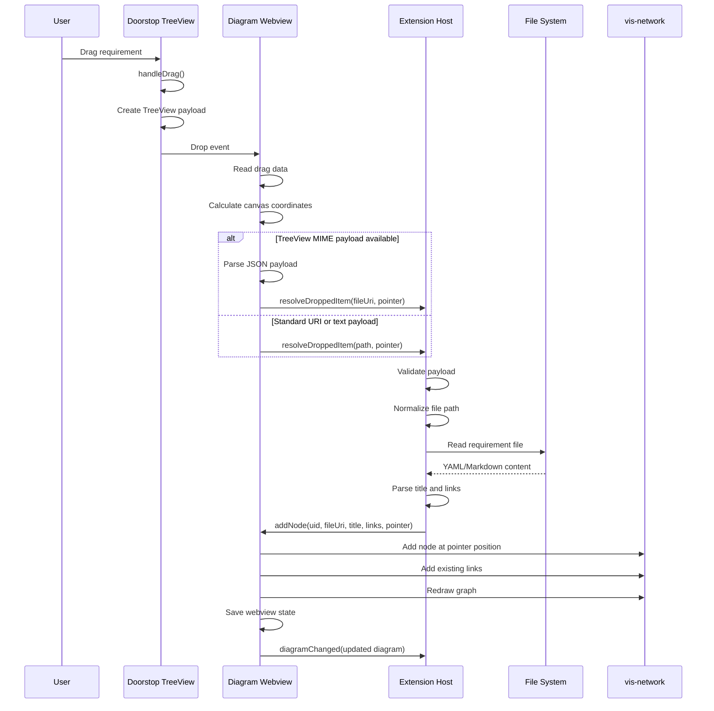

# Runtime View {#section-runtime-view}

## \<Runtime Scenario 1\> {#_runtime_scenario_1}

-   *\<insert runtime diagram or textual description of the scenario\>*

-   *\<insert description of the notable aspects of the interactions
    between the building block instances depicted in this diagram.\>*

## \<Runtime Scenario 2\> {#_runtime_scenario_2}

## ...​

## \<Runtime Scenario n\> {#_runtime_scenario_n}

### Adding something to the diagramm

