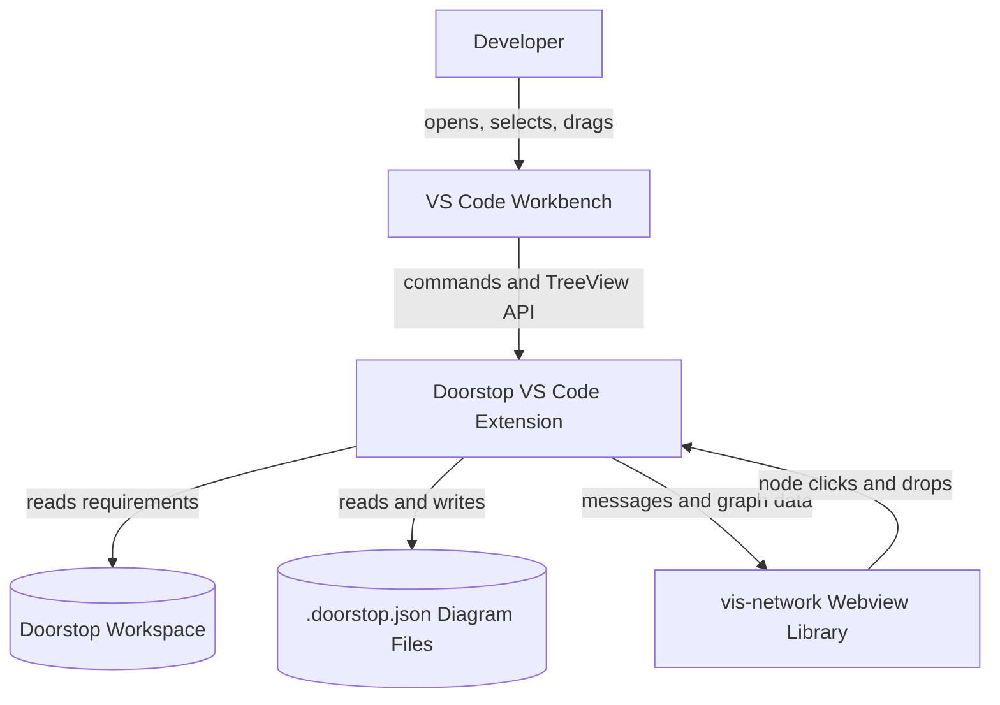
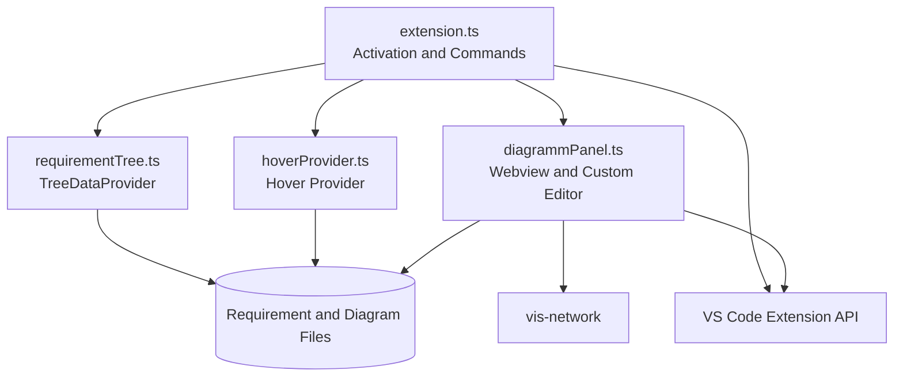
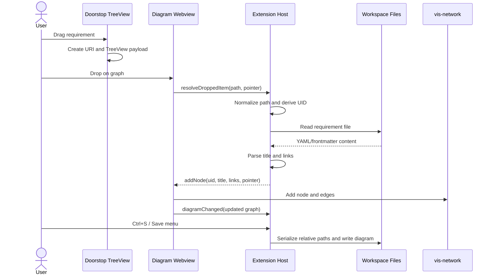

# Doorstop Requirements for VS Code

> it is outdated. the latest features are not represented here.

Compact arc42 architecture description for the current implementation.

## 1. Requirements & Goals

### Purpose

- Integrate Doorstop requirements into the VS Code workflow.
- Display requirements in a hierarchical TreeView.
- Provide hover details and traceability links for requirement IDs.
- Build, persist, and reopen interactive traceability diagrams.
- Support drag-and-drop from the editor and Doorstop TreeView.

### Quality Goals

| Priority | Goal | Concrete expectation |
| --- | --- | --- |
| 1 | Usability | Requirements and diagrams are reachable without leaving VS Code. |
| 2 | Reliability | Invalid files or drag payloads fail without crashing the extension host. |
| 3 | Portability | Diagram files use workspace-relative requirement paths. |

## 2. Context & Scope

### Interfaces

- **VS Code UI:** Activity Bar, Doorstop Hierarchy TreeView, editor, menus, and commands.
- **Requirement workspace:** `.doorstop.yml`, `.yml`, and Markdown files with YAML frontmatter.
- **Diagram files:** `*.doorstop.json`, opened through a VS Code custom editor.
- **Webview bridge:** JSON messages between the extension host and the diagram webview.
- **External library:** `vis-network` renders and interacts with the graph in the webview.

## 3. Building Block View

| Component | Responsibility |
| --- | --- |
| `extension.ts` | Activation, commands, custom editor provider, TreeView wiring, synchronization, and drag source. |
| `requirementTree.ts` | Discovers, parses, hierarchically organizes, and exposes requirements. |
| `diagrammPanel.ts` | Hosts the graph webview, resolves drops, loads/saves diagrams, and forwards node actions. |
| `hoverProvider.ts` | Provides requirement hover content and reverse-link information. |
| `vis-network` | Renders graph nodes, edges, movement, and canvas interactions. |

## 4. Runtime View

### Critical Workflows

- **Activation:** VS Code activates the extension; commands, TreeView, custom editor, and hover provider are registered.
- **Requirement navigation:** Active editor changes or graph clicks identify a requirement and attempt to reveal it in the TreeView.
- **Drag and drop:** A TreeView item or editor payload reaches the webview, is resolved by the host, parsed, and returned as graph node data.
- **Diagram persistence:** Graph changes mark a custom document dirty; Ctrl+S or the Save menu serializes it with relative paths.

## 5. Architecture Decisions

- **VS Code extension host plus webview:** Host-side filesystem and VS Code API access are separated from browser-side graph rendering.
- **`vis-network` for graph behavior:** Proven graph layout, hit testing, dragging, zooming, and edge rendering are delegated to the library.
- **Custom editor for `*.doorstop.json`:** Diagram files open directly as diagrams and participate in standard VS Code Save, Save As, Revert, and backup flows.
- **Workspace-relative diagram paths:** Saved diagrams remain portable across machines and workspace locations.
- **Provider-based TreeView:** Requirement discovery and hierarchy remain encapsulated in `DoorstopTreeProvider`, while commands coordinate navigation and activation.
