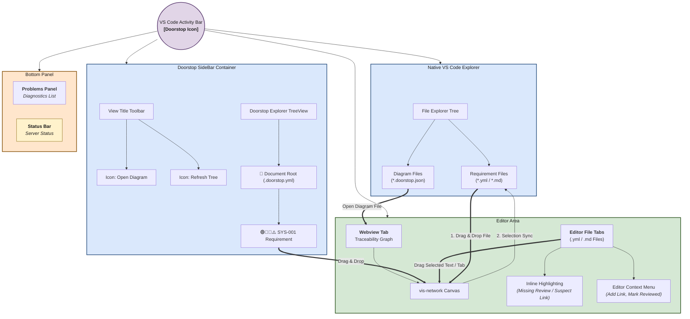

# GUI Concept: Menu & Feature Structure

## Colors

- Activity Bar: #E1D5E7
- Primary Side Bar: #DAE8FC
- Secondary Side Bar: #1BA1E2
- Editor Groups #D5E8D4
- Panel #FFE6CC
- Status Bar #FFF2CC

```mermaid
graph TD
    Root(("VS Code Activity Bar<br><b>[Doorstop Icon]</b>")) --> SideBar["Doorstop SideBar Container"]
    Root --> NativeExplorer["Native VS Code Explorer"]
    Root --> EditorArea["Editor Area"]
    Root --> BottomPanel["Bottom Panel & Status Bar"]

    subgraph SideBar ["Doorstop SideBar Container"]
        TitleBar["View Title Toolbar"]
        TitleBar --> BtnDiagram["Icon: Open Diagram"]
        TitleBar --> BtnRefresh["Icon: Refresh Tree"]

        Tree["Doorstop Explorer TreeView"]
        Tree --> DocRoot["📂 Document Root (.doorstop.yml)"]
        DocRoot --> ReqNode["🟢📜🔹⚠️ SYS-001 Requirement"]
    end

    subgraph NativeExplorer ["Native VS Code Explorer"]
        FileTree["File Explorer Tree"]
        FileTree --> RawFiles["Requirement Files<br>(*.yml / *.md)"]
        FileTree --> SavedDiagrams["Diagram Files<br>(*.doorstop.json)"]
    end

    subgraph EditorArea ["Editor Area"]
        DiagramWebview["<b>Webview Tab</b><br>Traceability Graph"]
        DiagramWebview --> Canvas["vis-network Canvas"]

        FileTabs["<b>Editor File Tabs</b><br>(.yml / .md Files)"]
        FileTabs --> Highlights["Inline Highlighting<br><i>(Missing Review / Suspect Link)</i>"]
        FileTabs --> ContextMenu["Editor Context Menu<br><i>(Add Link, Mark Reviewed)</i>"]
    end

    subgraph BottomPanel ["Bottom Panel"]
        ProblemsTab["<b>Problems Panel</b><br><i>Diagnostics List</i>"]
        StatusBar["<b>Status Bar</b><br><i>Server Status</i>"]
    end

    %% Interactions & Flows
    ReqNode == "Drag & Drop" ==> Canvas
    FileTabs == "Drag Selected Text / Tab" ==> Canvas
    RawFiles == "1. Drag & Drop File" ==> Canvas
    SavedDiagrams == "Open Diagram File" ==> DiagramWebview
    Canvas -- "2. Selection Sync" --> RawFiles

    %% High-Contrast Color Styles
    style Root fill:#E1D5E7,stroke:#523168,stroke-width:2px,color:#1A1A1A
    style SideBar fill:#DAE8FC,stroke:#234B7C,stroke-width:2px,color:#1A1A1A
    style NativeExplorer fill:#DAE8FC,stroke:#234B7C,stroke-width:2px,color:#1A1A1A
    style EditorArea fill:#D5E8D4,stroke:#27501A,stroke-width:2px,color:#1A1A1A
    style BottomPanel fill:#FFE6CC,stroke:#804A00,stroke-width:2px,color:#1A1A1A
    style StatusBar fill:#FFF2CC,stroke:#806200,stroke-width:1px,color:#1A1A1A

```
