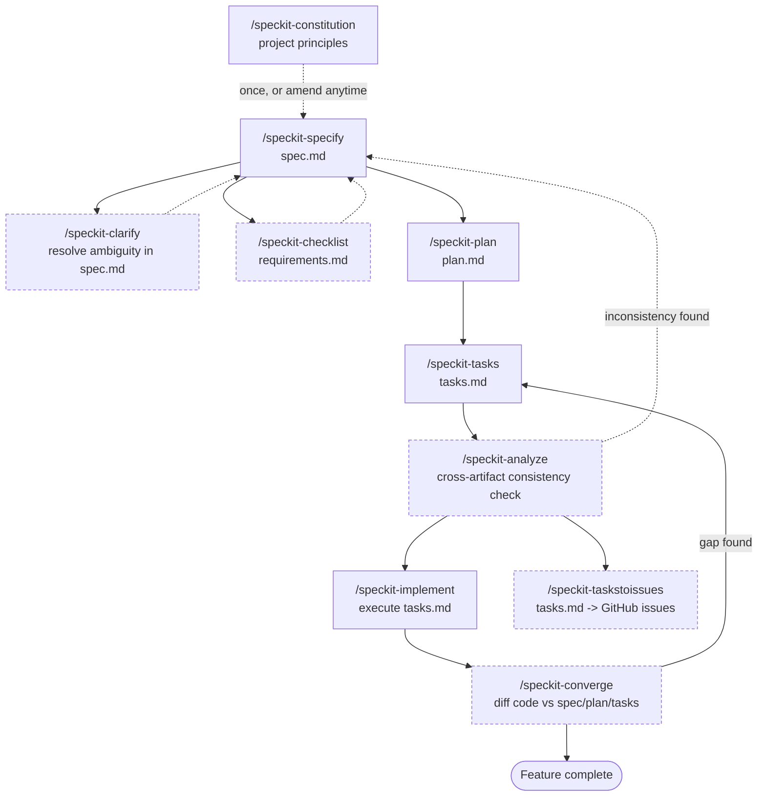
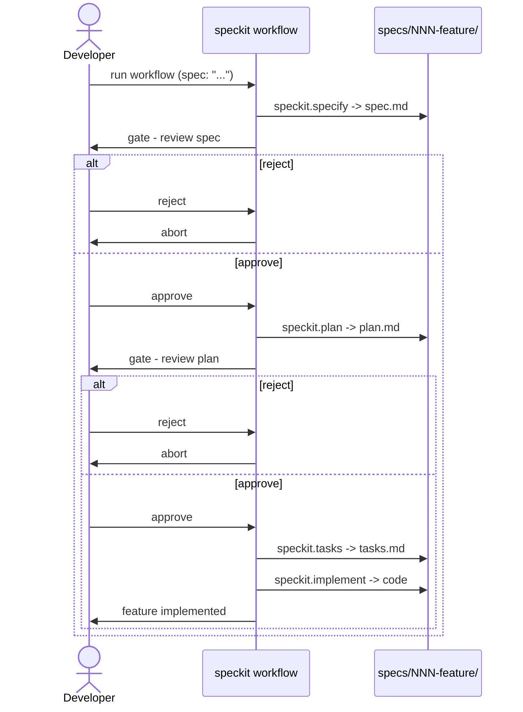

# Spec Kit Workflow

How the `/speckit-*` commands in this repo fit together. Grounded in
`.specify/workflows/speckit/workflow.yml` (the automated gated cycle) plus the
full set of commands available under `.claude/skills/speckit-*`.

## 1. Full command overview

Constitution is set up once (or amended later); everything else revolves
around one feature at a time, living in its own `specs/NNN-feature-name/`
folder.

Solid arrows are the required backbone (`specify -> plan -> tasks ->
implement`). Dashed nodes/arrows are optional enrichment steps you reach for
when you need them, not steps you must run every time:

- **Clarify** — only when the spec has real ambiguity (max 5 questions, and it
  edits `spec.md` in place rather than re-running specify).
- **Checklist** — a custom review checklist for the feature, on top of the
  auto-generated `requirements.md` from `/speckit-specify`.
- **Analyze** — a read-only consistency pass across spec/plan/tasks; only
  loops back to the spec if it finds something to fix.
- **Taskstoissues** — an alternative to `/speckit-implement` for teams that
  want a GitHub issue per task instead of Claude implementing directly.
- **Converge** — run after implementation (or after picking up someone else's
  partial work) to catch anything the tasks list missed; feeds any gap back
  in as new tasks rather than starting over.

## 2. The automated gated cycle

`.specify/workflows/speckit/workflow.yml` codifies the minimal, runnable
version of the above — the four required commands with a manual approval gate
between each design artifact:

Note: this gated cycle is deliberately narrower than section 1 — it has no
clarify/checklist/analyze/converge steps, so run those manually beforehand or
in between if the feature needs them; the workflow only automates the
required backbone plus its two approval gates.
